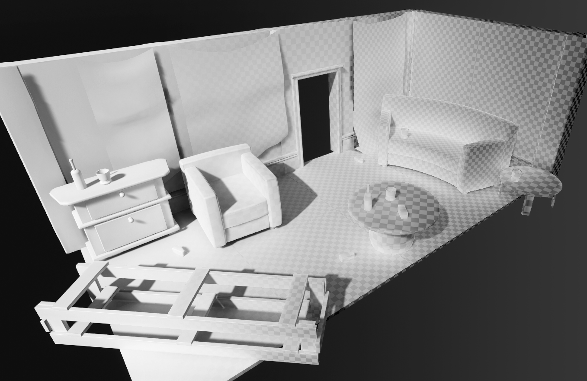
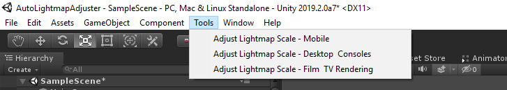
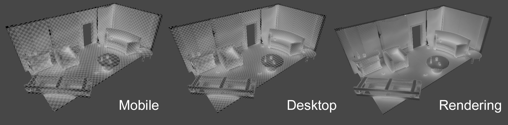
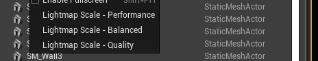
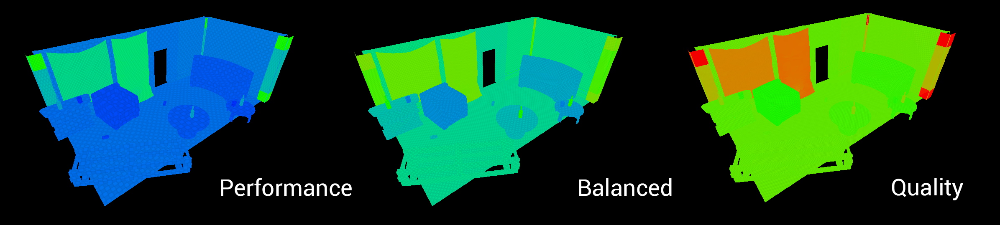
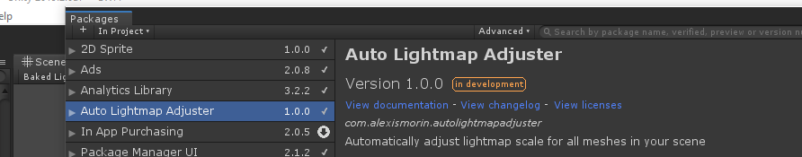
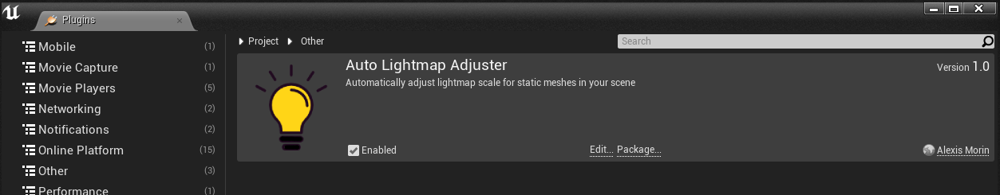

# Auto-Lightmap-Adjuster
## UE4 & Unity plugin to automatically adjust lightmap scale for meshes in your scene 

In both Unity and Unreal, adjusting the lightmap scale of various meshes in your scene is a necessary yet always tedious process. With lightmap stitching and denoising algorithms like Optix coming in, lightmap resolutions required for good-looking lightmaps are a lot lower than they used to be, and as fast at the lightbakes are in a well-optmized game engine scene adjusting arcane numbers or resolutions to reduce noise isn't really the most productive use of one's time. 

With this engine-agnostic plugin, correct lightmap resolution for your meshes is now one click away, with the package offering various resolutions depending on the engine use case.

### Usage - Unity

The package installed, simply navigate to the new *Tools/Adjust Lightmap Scale* menu items and select your resolution:

- *Mobile* is good for preview renders or mobile games (duh).
- *Desktop and Consoles* is what's going to work best for probably most game or cutscene usecases, it's a good tradeoff between resolution and memory.
- *Film & TV rendering* is for real-time render stuff or cutscenes - unless you're running an RTX rig you're going to have a bad time having this in a game.

### Usage - Unreal

The plugin installed, simply navigate to the new *Windows/Lightmap Scale* menu bar items and select your resolution:

- *Performance* is good for preview renders or mobile games (duh).
- *Balanced* is what's going to work best for probably most game or cutscene usecases, it's a good tradeoff between resolution and memory.
- *Quality* is for real-time render stuff or cutscenes - unless you're running an RTX rig you're going to have a bad time having this in a game.

### Install process
The repository is split for the two engines: the *Plugin* folder's for Unreal and the *Packages* folder for Unity.

#### Unity 2019.2

This is a plugin that makes use of Unity's *Package Manager* feature. Just drop the *com.alexismorin.autolightmapadjuster* folder into your *packages* folder (found at the same level as the Assets folder) and it should work out-of-the-box. If you're using a pre-packman version of Unity (maybe supported, can be made to work if you're courageous), take the stuff inside the *com.alexismorin.autolightmapadjuster* folder and then drag it anywhere into your regular project hierarchy.

#### Unreal 4.22

Just drag the *AutoLightmapAdjuster* folder into your project's *Plugins* folder (create it at the same level as your content folder if you don't have one already) and open your project - things should work out by themselves.

Per usual, this was whipped up in a couple of hours on my couch - bugs beware, tweak or fork as you wish.

### Bugs
- Unreal will sometimes not refresh the new lightmap sizes; just select all the static meshes in the scene and toggle on and off the override setting - that'll fix it.